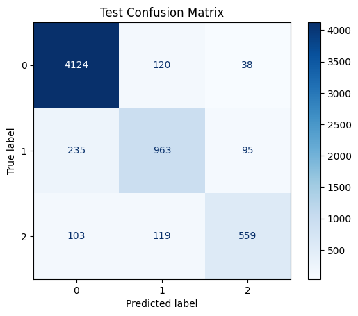
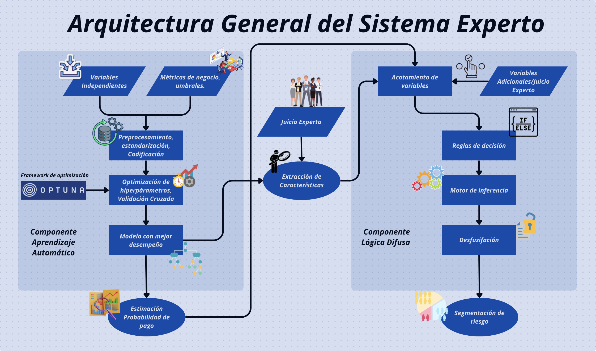
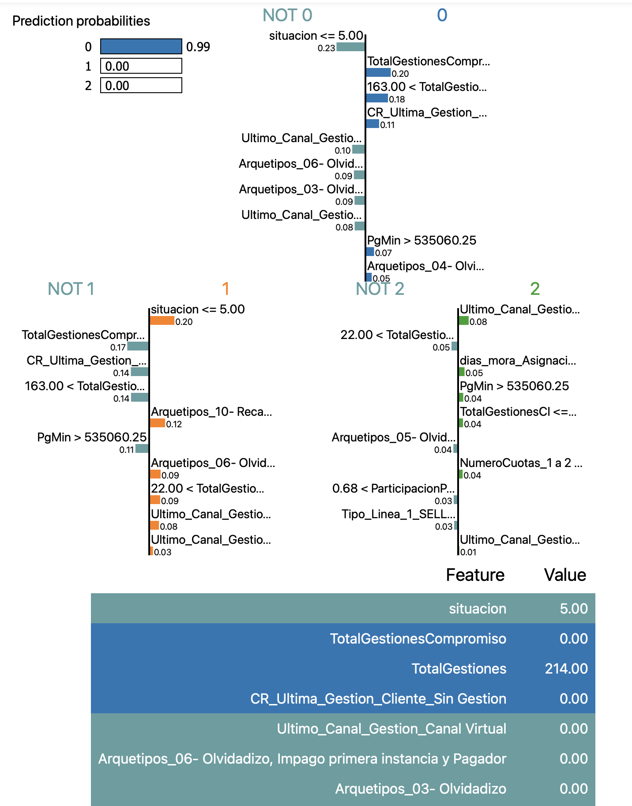
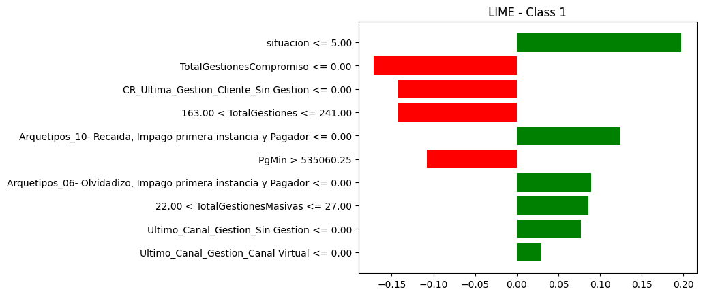
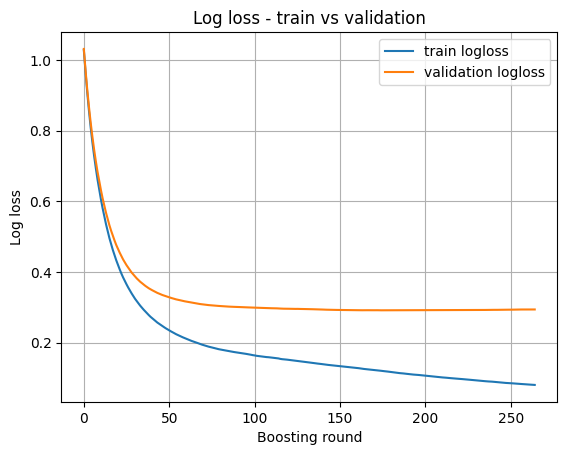
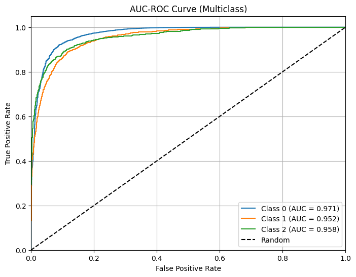
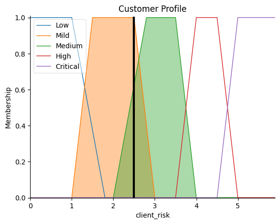

# 🧠 **Optimización de la Gestión de Cobranza en una BPO Colombiana: Integración de Modelos de Aprendizaje Automático e Inferencia Difusa para la Segmentación y Priorización de Clientes**

Este proyecto propone el diseño e implementación de un **sistema experto** para la clasificación y segmentación de clientes morosos, integrando modelos de **aprendizaje automático (XGBoost)** con un motor de **inferencia difusa**. Su objetivo es optimizar la asignación de recursos en entornos de cobranza mediante una clasificación de riesgo precisa y explicable.

> ⭐ Puedes acceder a la versión publicada en GitHub Pages [aquí](https://sergiosilveram.github.io/ProyectoDeGrado/intro.html)

---

## 🔎 Objetivo del proyecto

**Problema de investigación:**
¿Cómo puede una BPO en Colombia optimizar la gestión y recuperación de cartera vencida mediante un sistema inteligente que combine técnicas de aprendizaje automático y lógica difusa, con el fin de segmentar clientes y diseñar estrategias de cobranza personalizadas?

**Propuesta:** Integrar el poder predictivo de modelos como **XGBoost** con la flexibilidad y explicabilidad de la **lógica difusa**, construyendo un sistema robusto que soporte decisiones operativas en contextos financieros.

---

## 📊 Resultados destacados

* Modelo seleccionado: **XGBoost** (sin balanceo)
* Métricas en test:

  * **Precisión**: `0.844`
  * **F1-Score**: `0.825`
  * **AUC**: `0.96`

### 🔍 Visualizaciones clave del sistema

#### 📌 Matriz de confusión del modelo XGBoost



#### 🤖 Diagrama del sistema experto difuso



#### 📊 Explicaciones Locales por clase usando LIME





---

## 📖 Metodología

El proceso se dividó en dos grandes fases:

1. **Entrenamiento y selección del mejor clasificador:**

   * Modelos evaluados: ***Decision Tree***, ***Random Forest***, ***SVC***, ***KNN***, ***LGBM***, ***MLP***, ***XGBoost***.
   * Hiperparámetrización con ***Optuna***
   * Validación cruzada anidada.
   * Evaluación con métricas macro/weighted avg y estabilidad por pliegue.

2. **Integración con sistema experto difuso:**

   * Se definieron $143$ reglas ***IF-THEN*** usando juicio experto + FI del modelo XGBoost.
   * Inferencia mediante el enfoque ***Mamdani***.
   * Defuzzificación por el ***centroide***.

---

## 📂 Estructura del repositorio

```bash
ProyectoDeGrado/
├── Pruebas_anteriores/       # Versiones previas y experimentos iniciales
├── Scripts FL/               # Implementación completa del sistema experto
├── docs/                     # Documentos, notebooks y recursos visuales
│   ├── Sistema_Experto.png
│   ├── LIME.png
│   ├── cm_test.png
│   ├── Variables.md
│   ├── *.ipynb
```

---

## 💪 Contribuciones del proyecto

* Desarrollo de un sistema híbrido **interpretable y operativo**.
* Consolidación de un **pipeline automatizado** capaz de producir salidas .xlsx para soportar decisiones operativas.
* Aplicación efectiva de técnicas de explicabilidad local (LIME) para **cumplimiento regulatorio y trazabilidad**.

---

## 📊 Visualizaciones adicionales

| Curvas de pérdida         | AUC-ROC XGBoost          | Representación Visual de Salida del Sistema Experto|
| ------------------------- | ------------------------ |-------------------------------------------|
|  |  |

> Las visualizaciones presentadas evidencian la robustez del modelo.

---

## 🔄 Futuras extensiones

* Despliegue de una interfaz gráfica interactiva.
* Integración con bases ***PostgreSQL*** y automatización de informes.
* Mejora adaptativa de reglas difusas.
* Análisis de impacto financiero de cada decisión de segmentación.

---

## 👀 Código y resultados

✅ Visualiza online: [https://sergiosilveram.github.io/ProyectoDeGrado/intro.html](https://sergiosilveram.github.io/ProyectoDeGrado/intro.html)

---

## 📅 Estado del proyecto

* [x] Entrenamiento de modelos y benchmarking
* [x] Construcción de motor difuso
* [x] Integración completa en pipeline
* [x] Exportación de resultados a Excel
* [ ] Despliegue productivo con interfaz gráfica

---


## 📄 Referencias

* Documentación completa, visualizaciones y notebooks disponibles en el directorio `docs/`
* El sistema es compatible con Python 3.10+, `scikit-learn`, `xgboost`, `skfuzzy`, `lime`, `optuna` y `pandas`

> © Sergio Silvera M. - Proyecto de Grado Maestría Analítica de Datos, Universidad del Norte
