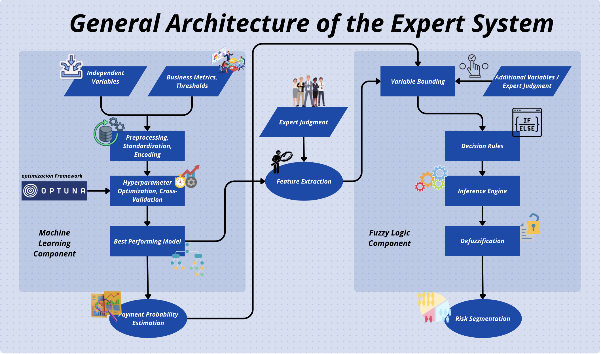

# 🧠 **Optimizing Debt Collection Management in a Colombian BPO: Integration of Machine Learning Models and Fuzzy Inference for Client Segmentation and Prioritization**

This project proposes the design and implementation of an **expert system** for the classification and segmentation of delinquent clients, integrating **machine learning models (XGBoost)** with a **fuzzy inference engine**. Its goal is to optimize the allocation of resources in collection environments through accurate and explainable risk classification.

> ⭐ You can access the published version on GitHub Pages [here](https://sergiosilveram.github.io/ProyectoDeGrado/intro.html)

---

## 🔎 Project Objective

**Research question:**  
How can a BPO in Colombia optimize overdue portfolio management and recovery using an intelligent system that combines machine learning techniques and fuzzy logic to segment clients and design personalized collection strategies?

**Proposal:**  
Integrate the predictive power of models like **XGBoost** with the flexibility and explainability of **fuzzy logic**, building a robust system to support operational decisions in financial contexts.

---

## 📊 Key Results

* Selected model: **XGBoost** (unbalanced)
* Test metrics:
  * **Accuracy**: `0.844`
  * **F1-Score**: `0.825`
  * **AUC**: `0.96`

### 🔍 Key Visualizations of the System

#### 📌 Confusion Matrix of the XGBoost Model


#### 🤖 Diagram of the Fuzzy Expert System



#### 📊 Local Explanations per Class Using LIME


---

## 📖 Methodology

The process was divided into two main phases:

1. **Training and selection of the best classifier:**
   * Evaluated models: ***Decision Tree***, ***Random Forest***, ***SVC***, ***KNN***, ***LGBM***, ***MLP***, ***XGBoost***
   * Hyperparameter tuning with ***Optuna***
   * Nested cross-validation
   * Evaluation using macro/weighted avg metrics and fold stability

2. **Integration with fuzzy expert system:**
   * A total of $143$ ***IF-THEN*** rules were defined using expert judgment + FI from the XGBoost model
   * Inference via the ***Mamdani*** approach
   * Defuzzification using the ***centroid*** method

---

## 📂 Repository Structure

```bash
ProyectoDeGrado/
├── Pruebas_anteriores/       # Previous versions and initial experiments
├── Scripts FL/               # Full implementation of the expert system
├── docs/                     # Documents, notebooks, and visual resources
│   ├── Sistema_Experto.png
│   ├── LIME.png
│   ├── cm_test.png
│   ├── Variables.md
│   ├── *.ipynb
````

---

## 💪 Project Contributions

* Development of a **hybrid, interpretable, and operational** system
* Consolidation of an **automated pipeline** capable of generating `.xlsx` outputs to support operational decision-making
* Effective application of local explainability techniques (LIME) for **regulatory compliance and traceability**

---

## 📊 Additional Visualizations

| Loss Curves            | AUC-ROC XGBoost            | Visual Output of the Expert System |
| ---------------------- | -------------------------- | ---------------------------------- |
|  |  |          |

> The presented visualizations demonstrate the robustness of the model.

---

## 🔄 Future Extensions

* Deployment of an interactive graphical interface
* Integration with ***PostgreSQL*** databases and report automation
* Adaptive improvement of fuzzy rules
* Financial impact analysis of each segmentation decision

---

## 👀 Code and Results

✅ View online: [https://sergiosilveram.github.io/ProyectoDeGrado/intro.html](https://sergiosilveram.github.io/ProyectoDeGrado/intro.html)

---

## 📅 Project Status

* [x] Model training and benchmarking
* [x] Fuzzy engine development
* [x] Full pipeline integration
* [x] Export of results to Excel
* [ ] Production deployment with graphical interface

---

## 📄 References

* Complete documentation, visualizations, and notebooks available in the `docs/` directory
* The system is compatible with Python 3.10+, `scikit-learn`, `xgboost`, `skfuzzy`, `lime`, `optuna`, and `pandas`

> © Sergio Silvera M. - Master's Thesis Project, Data Analytics, Universidad del Norte
